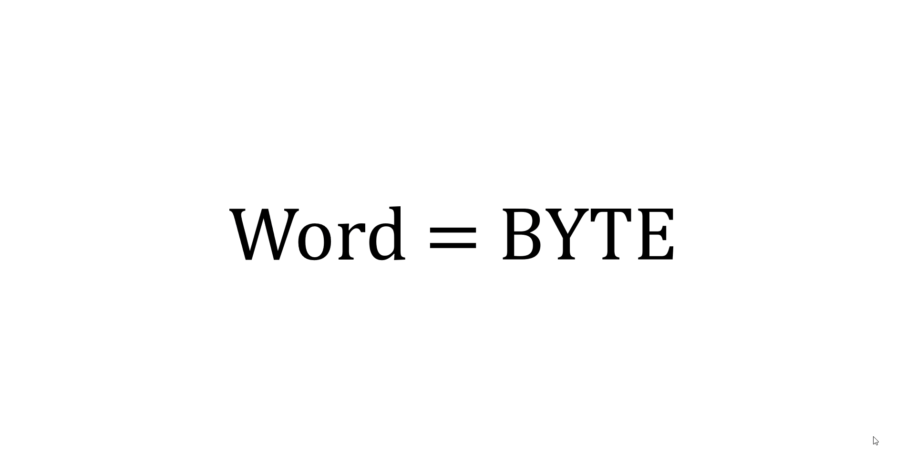
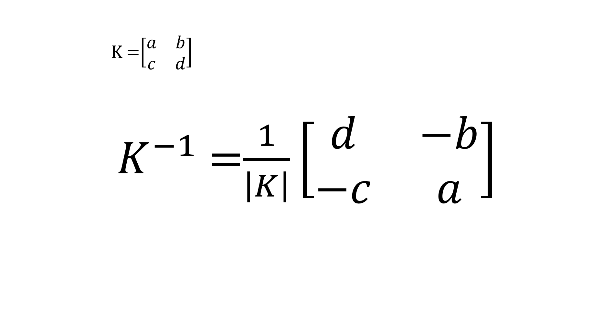

# Hill Cipher Encryption and Decryption (for 2x2 matrix)

This repository contains a Python implementation of the Hill cipher encryption and decryption algorithm.

**The Hill cipher** is a polygraphic substitution cipher based on **linear algebra** that operates on blocks of 2 or 3 letters at a time (depending on the word), each letter represented by a number in modulo 26, and using a key matrix with nxn dimension (there's a 2x2 default key matrix in the code). The implementation is done purely in Python, without relying on external libraries for matrix calculations.

## Introduction

This code was developed as a college final project to gain a deeper understanding of matrix operations and cryptography. The objective was to implement the Hill cipher encryption and decryption algorithm for any 4 letter word from scratch, without using any external libraries or predefined matrix functions.

I aimed to enhance my knowledge about matrix, determinant, modular arithmetic, and encryption techniques by coding the Hill cipher algorithm manually. The project allowed us to explore the fundamental concepts underlying the Hill cipher and gain practical experience in implementing mathematical algorithms in Python.

## Usage

To use the program, you can follow these steps:

1. Clone the repository:

   `git clone https://github.com/Luislev/HillCipher_2x2.git`

2. navigate to the directory and run the 'hill_cipher.py' file:

    `python3 hill_cipher.py`

Once it's done, it will present a menu with the following options:

 - **About key matrix**: Edit, view, or reset the current key matrix.
 - **Encrypt word**: Enter a word and encrypt it using the Hill cipher.
 - **Decrypt word**: Enter an encrypted word and decrypt it using the Hill decipher.
 - **Exit**: Quit the program.

Now you can interact with the program.

You need to have Python 3.x installed on your system to run the program.

## How does the program work?

First of all, i chose the word "**Byte**" for the plaintext example but any four-letter word can be used. The code applies the upper function to make the word uppercase, and then splits the word in 2 vectors, then, the vectors pass through a conversion table to encrypt the word, here's the process:

The key part to make the cipher work is, well, the key matrix. **To create one**, you need to ensure that the matrix have an **inverse**, the determinant has to be **non-zero**, and it doesn't have to be divisible by **2 or 13**.
If we have the key matrix, the code executes a matrix multiplication with both vectors and apply the modulo 26 to optain the encrypted word:

With this information, the encrypted word of **BYTE** is **XSRG**.

To decrypt a coded word, we need the inverse of the key matrix in modulo 26 just like in this GIF:

Once we have obtained the inverse of the key matrix in modulo 26, we compute it with the vectors of the encrypted word (in this case i'm using **XSRG**), reversing the encryption process until we get the decrypted word.

## Contributing

Contributions to this project are welcome. If you find any issues or want to enhance the program, feel free to fork the repo create a pull request!🤗
You can also simply open an issue with the tag "enhancement". Don't forget to give the project a star!🌟 Thanks again!

## Author

Luis Leiva - Software Development Student at _Universidad Tecnológica de Panamá_

## References
 - [Hill cipher - Wikipedia](https://www.wikipedia.org/wiki/Hill_cipher)
 - [Hill Cipher - GeeksforGeeks](https://www.geeksforgeeks.org/hill-cipher/)
